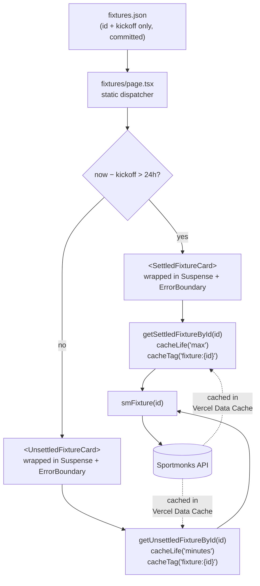

# ADR-005: Static fixture index and state-aware per-fixture caching

## Status

Accepted

## Context

The season fixtures page (`/fixtures`) drives most of the Sportmonks API traffic this app generates. The pre-change pipeline was:

1. On every request, call `getFixtures()` — two paginated Sportmonks calls returning the full season's fixtures with includes (league, participants, scores, state, periods, venue).
2. Call `getNextFixture()` — an additional call (plus secondary TV-station fetches) used only to discover the single fixture ID for the "next match" scroll-highlight.
3. Render every card inline on the page's server render. A single Sportmonks failure blanked the entire schedule.

Two things about this workload make it a poor fit for per-request fetching:

- **The fixture list itself is ~static.** Premier League schedules change fewer than five times a season (postponements, cup-tie replacements). The overwhelming majority of requests re-fetch data that has not moved.
- **Individual fixtures have sharply different staleness windows.** A settled past match (scores final, lineups known, stats reconciled) never changes in practice — barring a rare retroactive correction. An upcoming or in-progress fixture changes minute-to-minute while live, and hour-to-hour in the days leading up to kickoff.

PR #69 added Next 16 cache components (`'use cache'` + `cacheLife` + `cacheTag`) to this repo but the fixtures path was not yet using them at fixture-ID granularity. The bulk `getFixtures()` response was cached, but one tenant's request fetched all fixtures for every tenant; every deploy discarded the cache; and one failure in the bulk call failed the entire route.

### The public-repo constraint

An early draft of this work (tracked on the original issue #63) proposed committing full Sportmonks fixture payloads into the repo as `fixtures.json`. This repository is public. Sportmonks match data (scores, lineups, events, stats) is licensed data and cannot be committed to a public repo. A private-npm-package escape hatch was considered and rejected — the infrastructure cost (private registry, build-time auth, cross-repo release coordination) is not warranted for a problem the Vercel Data Cache can solve for free.

### What the Data Cache gives us

Next 16's `'use cache'` integrates with Vercel's Data Cache. Three properties matter here:

- **Persists across deploys.** A cache entry written on deploy N is still hit on deploy N+1 unless the `cacheTag` is revalidated or the profile TTL elapses.
- **Shared across function instances.** All serverless invocations in a region (and across regions on Pro, which this team is on — see ADR-003) read the same store.
- **Keyed on function identity + argument tuple.** Two tenants calling `getFixtureById(19477832)` hit the same cache entry. A per-tenant wrapper would defeat this; a fixture-ID-only signature preserves it.

Together these mean: if every rendered card is fetched by fixture ID through a cached function, the Data Cache will deduplicate across tenants for free, without any external cache store (no Redis, no KV).

## Decision

### A committed, licensing-safe fixture index

Commit a minimal `src/lib/sportmonks/fixtures.json` containing only `{ id, kickoff }` per fixture. IDs and kickoff timestamps are not licensed match data — they are the schedule, which is publicly distributed. Everything licensed (scores, lineups, stats) stays behind the Sportmonks API and is never committed.

The index is maintained by a daily GitHub Actions cron (`.github/workflows/sync-fixtures.yml`) that runs `scripts/sync-fixtures.mjs`. The script fetches the full season from Sportmonks, reduces to `{ id, kickoff }`, sorts by `id`, and compares against the committed file. If the content is unchanged, the script exits without writing and the workflow opens no PR. If the content has changed, the workflow opens a PR for human review. Schedules shift rarely enough that this cadence imposes near-zero ongoing cost.

### Two cached fetchers, keyed on fixture ID

Replace the single bulk `getFixtures()` with two single-fixture fetchers in `src/lib/data/fixtures.ts`:

- `getSettledFixtureById(id)` — `cacheLife('max')`, `cacheTag('fixture:${id}')`. For fixtures more than 24 hours past kickoff, data is effectively frozen; the Data Cache should hold onto it indefinitely.
- `getUnsettledFixtureById(id)` — `cacheLife('minutes')`, `cacheTag('fixture:${id}')`. For upcoming, live, and just-ended fixtures, short TTL keeps scores and state fresh.

Both take only `id: number` to preserve cross-tenant cache sharing. Both apply the existing `shite()` rewrite at the data layer per prior convention. The 24-hour "settled" threshold balances two concerns: staying cache-eligible as early as possible after the final whistle, while leaving a buffer for Sportmonks' post-match reconciliation (stats corrections, delayed lineup entries).

### Per-card isolation

The fixtures page becomes a static dispatcher over the committed index:

```
for each { id, kickoff } in fixtures.json:
  isSettled = (now - kickoff) > 24h
  Card = isSettled ? SettledFixtureCard : UnsettledFixtureCard
  render <ErrorBoundary><Suspense><Card fixtureId={id} /></Suspense></ErrorBoundary>
```

Each card is wrapped in `react-error-boundary` + `<Suspense>`. A Sportmonks failure on one fixture renders a single-card error fallback; the rest of the page streams in normally. The existing `FixtureCardLoading` skeleton is reused as the Suspense fallback, and `src/app/[domain]/fixtures/loading.tsx` renders exactly `fixtures.length` skeletons for an exact first-paint match.

The "next fixture" scroll anchor (HTML id `next-fixture`) is derived on the server by sorting the index by `kickoff` and selecting the first fixture whose kickoff is within the unsettled window. The client-side scroll behavior in `FixtureCard.tsx` is unchanged; only the source of the ID moved from an API round-trip (`getNextFixture()`) to the static index.

### Request-path flow



### What is deliberately not in scope

- **No automated cache invalidation.** `cacheTag('fixture:${id}')` reserves the hook; a manual invalidation path can be layered on later if a real need materializes. Cold-path discovery of stale data is acceptable for this workload.
- **No changes to `getNextFixture()`.** It is still used by the home page and game-card routes and is out of scope.
- **No custom `cacheLife` profiles.** `'max'` and `'minutes'` are the built-in Next 16 profiles; no `experimental.cacheLife` configuration is needed.

### Rejected alternatives

- **Commit full fixture payloads to the public repo.** Violates Sportmonks licensing terms. Rejected before implementation began.
- **Redis / Upstash / external cache store.** Vercel Data Cache already persists across deploys and shares across all function instances. Keying the fetchers on fixture ID alone gives cross-tenant sharing for free. Adding Redis would be redundant infrastructure for a problem already solved by the framework.
- **Private npm package for match data.** Solves licensing but introduces a private registry, build-time auth, and cross-repo release coordination. Premature infrastructure given the Data Cache path works.
- **Keep the bulk `getFixtures()` with tighter TTLs.** Does not fix per-card isolation (one failure still blanks the page) and does not share across tenants the way per-fixture keys do.

## Consequences

- **Cold-path cost shifts from per-request to per-fixture-first-view.** The first render of a given fixture's card triggers one Sportmonks call; every subsequent render (any tenant, any request) hits the Data Cache. Over the life of a deploy the number of Sportmonks calls the fixtures page generates trends to the count of unique fixtures viewed, not the count of page views.
- **Cross-tenant cache sharing comes for free.** All six tenants rendering the same fixture share the same cache entry. No Redis, no tenant-aware keying to reason about.
- **Per-card isolation.** One fixture's Sportmonks failure renders a single card's error fallback, not a blank page. The rest of the schedule streams in.
- **`fixtures.json` is a committed artifact.** The daily cron opens a PR only when the content actually changes. Schedule shifts land as human-reviewed PRs — not silent auto-merges — which is consistent with the low-frequency, high-visibility nature of Premier League schedule changes.
- **A rare retroactive Sportmonks correction to a settled fixture stays cached.** `cacheLife('max')` means a historic stat edit will not surface until the cache entry is manually invalidated or the function signature changes. The `cacheTag('fixture:${id}')` is the escape hatch when that need comes up.
- **Dependency added:** `react-error-boundary`. Small, stable, widely-used; the equivalent local class component would be strictly more code to maintain.
- **`getFixtures()` is deleted.** `getNextFixture()` is the only remaining caller of `smFixtures()`; the latter is kept. The unused `_id` parameter on `smFixtures` can be dropped as incidental cleanup.
- **Loading skeleton count is exact.** `loading.tsx` reads `fixtures.length` from the committed index, so first-paint skeletons match the rendered page exactly — no over- or under-rendering.
