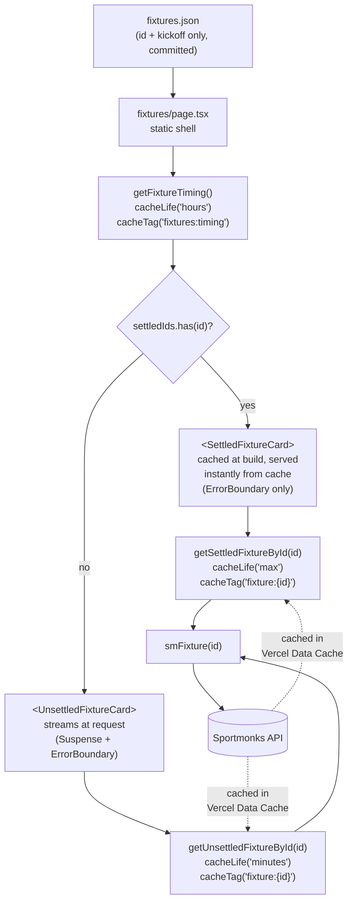

# ADR-005: Static fixture index, state-aware caching, and build-time prerender

## Status

Accepted

## Context

The season fixtures page (`/fixtures`) drives most of the Sportmonks API traffic this app generates. The pre-change pipeline was:

1. On every request, call `getFixtures()` — two paginated Sportmonks calls returning the full season's fixtures with includes (league, participants, scores, state, periods, venue).
2. Call `getNextFixture()` — an additional call (plus secondary TV-station fetches) used only to discover the single fixture ID for the "next match" scroll-highlight.
3. Render every card inline on the page's server render. A single Sportmonks failure blanked the entire schedule.

Two things about this workload make it a poor fit for per-request fetching:

- **The fixture list itself is ~static.** Premier League schedules change fewer than five times a season (postponements, cup-tie replacements). The overwhelming majority of requests re-fetch data that has not moved.
- **Individual fixtures have sharply different staleness windows.** A settled past match (scores final, lineups known, stats reconciled) never changes in practice — barring a rare retroactive correction. An upcoming or in-progress fixture changes minute-to-minute while live, and hour-to-hour in the days leading up to kickoff.

PR #69 added Next 16 cache components (`'use cache'` + `cacheLife` + `cacheTag`) to this repo. `cacheComponents: true` is enabled in `next.config.ts` — the Next 16 replacement for `experimental.ppr`, which gives us static shell + cached components + dynamic Suspense holes in a single route.

### The public-repo constraint

An early draft proposed committing full Sportmonks fixture payloads into the repo as `fixtures.json`. This repository is public. Committing raw structured match data (scores, lineups, events, stats) publishes a re-scrapeable copy of licensed Sportmonks data into git history and violates their terms. This ADR's decisions flow from that narrow constraint.

The ToS line is about **raw data redistribution**, not about all forms of persisted rendering. Pre-rendered HTML of the same matches — shipped as a Vercel build artifact — is a derivative display of licensed data, which is exactly what the API license authorizes. Build output lives in Vercel's non-public build cache, not git. That distinction makes build-time prerender of settled fixtures architecturally safe.

### What the Data Cache gives us

Next 16's `'use cache'` integrates with Vercel's Data Cache. Three properties matter here:

- **Persists across deploys.** A cache entry written on deploy N is still hit on deploy N+1 unless the `cacheTag` is revalidated or the profile TTL elapses.
- **Shared across function instances.** All serverless invocations in a region (and across regions on Pro, which this team is on — see ADR-003) read the same store.
- **Keyed on function identity + argument tuple.** Two tenants calling `getSettledFixtureById(19477832)` hit the same cache entry. A per-tenant wrapper would defeat this; a fixture-ID-only signature preserves it.

Together these mean: if every rendered card is fetched by fixture ID through a cached function, the Data Cache will deduplicate across tenants for free, without any external cache store (no Redis, no KV).

### Baseline Lighthouse observation

Before this work, `/fixtures` rendered as streaming SSR with 61 Suspense boundaries on the critical path. Lighthouse perf scores were `0.82, 0.88, 0.9` across three sequential runs — consistent enough to rule out cold-cache noise and below the `0.95` threshold applied elsewhere in the app.

## Decision

### A committed, licensing-safe fixture index

Commit a minimal `src/lib/sportmonks/fixtures.json` containing only `{ id, kickoff }` per fixture. IDs and kickoff timestamps are not licensed match data — they are the schedule, which is publicly distributed. Everything licensed (scores, lineups, stats) stays behind the Sportmonks API and is never committed.

The index is maintained by a daily GitHub Actions cron (`.github/workflows/sync-fixtures.yml`) that runs `scripts/sync-fixtures.mjs`. The script fetches the full season from Sportmonks, reduces to `{ id, kickoff }`, sorts by `id`, and compares against the committed file. If the content is unchanged, the script exits without writing and the workflow opens no PR. If the content has changed, the workflow opens a PR for human review. Schedules shift rarely enough that this cadence imposes near-zero ongoing cost.

### Two cached fetchers, keyed on fixture ID

Replace the single bulk `getFixtures()` with two single-fixture fetchers in `src/lib/data/fixtures.ts`:

- `getSettledFixtureById(id)` — `cacheLife('max')`, `cacheTag('fixture:${id}')`. For fixtures more than 24 hours past kickoff, data is effectively frozen; the Data Cache should hold onto it indefinitely. This profile also makes the fetcher eligible for build-time evaluation, which is how settled cards end up prerendered in the shell (see "Build-time prerender" below).
- `getUnsettledFixtureById(id)` — `cacheLife('minutes')`, `cacheTag('fixture:${id}')`. For upcoming, live, and just-ended fixtures, short TTL keeps scores and state fresh.

Both take only `id: number` to preserve cross-tenant cache sharing. Both apply the existing `shite()` rewrite at the data layer per prior convention. The 24-hour "settled" threshold balances two concerns: staying cache-eligible as early as possible after the final whistle, while leaving a buffer for Sportmonks' post-match reconciliation (stats corrections, delayed lineup entries).

### Build-time PPR shell + request-time streaming from cache

Under `cacheComponents: true`, `/fixtures` is Partial-Prerender-eligible. `generateStaticParams()` enumerates every branch domain so Next builds one concrete PPR entry per tenant (`/<tenant>/fixtures`); the prerendered RSC segment — `.next/server/app/<tenant>/fixtures.segments/_full.segment.rsc` — ships in the build artifact with every settled fixture's payload already embedded.

At request time, the static shell streams first and each card's Suspense boundary resolves from the Vercel Data Cache. Settled cards hit `cacheLife('max')` and come back instantly (no network); unsettled cards hit `cacheLife('minutes')` and may call Sportmonks if the per-fixture entry has expired. The initial HTML arriving at the browser contains `FixtureCardLoading` skeletons while React resolves each boundary, then `<template id="B:N">` chunks + `$RC(...)` inline the real card markup. For settled cards the whole cycle completes in single-digit to low-double-digit milliseconds from the shell paint.

Two changes make this work cleanly:

- **Cached timing helper.** `src/lib/data/fixtureTiming.ts` exports `getFixtureTiming()` (`'use cache'`, `cacheLife('hours')`, `cacheTag('fixtures:timing')`). It computes `nowS = Math.floor(Date.now() / 1000)` — allowed inside `'use cache'` — and returns `{ nextFixtureId, settledIds }`. The page body awaits this helper and dispatches per fixture without calling `await connection()` or touching `Date.now()` directly, so the route stays PPR-eligible.
- **Client-island scroll effect.** The scroll-into-view behavior that previously forced `'use client'` on the whole `FixtureCard` is extracted into a null-rendering client component (`FixtureCardAnchor`). It runs `document.getElementById(id)?.scrollIntoView(...)` on mount. The `FixtureCard` body is now a server component, which is what the PPR render pipeline needs.

**What cached-component rendering is not.** `'use cache'` + `cacheLife('max')` does not inline the cached JSX directly into the prerendered static HTML shell; cached data sits in the Data Cache and streams back through the normal Suspense pipeline at request time. The practical difference from "inlined in shell" is one render frame of skeleton flash on initial paint. The ADR's architectural promise — zero Sportmonks calls for settled cards, cross-tenant sharing, per-card isolation — holds regardless.

### Per-card isolation

Each card is wrapped in `react-error-boundary`. Settled cards render directly inside the boundary (no Suspense — data is fully cached so there is nothing to fall back to). Unsettled cards wrap the boundary's child in `<Suspense fallback={<FixtureCardLoading />}>` so live scores can stream. A Sportmonks failure on any one fixture renders a single-card error fallback; the rest of the page is unaffected.

The "next fixture" scroll anchor (HTML id `next-fixture`) is derived inside the cached timing helper — sort by `kickoff`, pick the first fixture whose kickoff has not yet crossed the 24h-settled threshold. The anchor id is rendered server-side on the one matching card; the client island reads that id and scrolls on mount.

### Request-path flow

### What is deliberately not in scope

- **No automated cache invalidation.** `cacheTag('fixture:${id}')` reserves the hook; a manual invalidation path can be layered on later if a real need materializes. Cold-path discovery of stale data is acceptable for this workload.
- **No changes to `getNextFixture()`.** It is still used by the home page and game-card routes and is out of scope.
- **No custom `cacheLife` profiles.** `'max'`, `'hours'`, and `'minutes'` are the built-in Next 16 profiles; no `experimental.cacheLife` configuration is needed.

### Rejected alternatives

- **Commit full fixture payloads to the public repo.** Re-publishes licensed structured data into public git history. Rejected before implementation began.
- **Redis / Upstash / external cache store.** Vercel Data Cache already persists across deploys and shares across all function instances. Keying the fetchers on fixture ID alone gives cross-tenant sharing for free. Adding Redis would be redundant infrastructure for a problem already solved by the framework.
- **Private npm package for match data.** Solves licensing but introduces a private registry, build-time auth, and cross-repo release coordination. Premature infrastructure given the Data Cache path works.
- **Keep the bulk `getFixtures()` with tighter TTLs.** Does not fix per-card isolation (one failure still blanks the page) and does not share across tenants the way per-fixture keys do.
- **Opt the whole page out of prerender with `connection()`.** The interim shape of this work did this to allow `Date.now()` in the page body. The cached timing helper replaces it; the whole page is PPR-eligible again, the shell plus the settled-card RSC payloads ship in the build artifact, and Lighthouse perf on `/fixtures` clears the app-wide `0.95` threshold.

## Consequences

- **Settled-card payloads are embedded in the build artifact, not the first-paint HTML.** `generateStaticParams()` enumerates every branch domain and Next builds one PPR entry per tenant. The prerendered RSC segment (`.next/server/app/<tenant>/fixtures.segments/_full.segment.rsc`) carries the full settled-fixture payload — scores, lineups, stats, all of it. What the browser gets on first paint is the static shell plus skeletons; `'use cache'` streams the cached card markup back into each Suspense boundary from the Data Cache on the same response. Sportmonks is not called at request time for settled fixtures.
- **Unsettled cards stream in at request time.** `<Suspense fallback={<FixtureCardLoading />}>` wraps each; the skeleton is visible until the server-side cache entry resolves. `cacheLife('minutes')` keeps scores fresh.
- **Sportmonks call count on `/fixtures` trends to `count(unsettled fixtures)`.** Settled cards' data is already in the Data Cache (seeded by build-time prerender or the first request after a tag invalidation).
- **Cross-tenant cache sharing comes for free.** All six tenants rendering the same fixture share the same cache entry. No Redis, no tenant-aware keying to reason about.
- **Per-card isolation.** One fixture's Sportmonks failure renders a single card's error fallback, not a blank page. The rest of the schedule is untouched.
- **Timing decisions revalidate hourly.** `getFixtureTiming()` uses `cacheLife('hours')`, so when a fixture crosses the 24h-past-kickoff threshold, it can take up to ~1 hour before the page re-dispatches from `UnsettledFixtureCard` to `SettledFixtureCard` and the `#next-fixture` anchor moves to the next match. Acceptable for a scroll target.
- **`fixtures.json` is a committed artifact.** The daily cron opens a PR only when the content actually changes. Schedule shifts land as human-reviewed PRs.
- **A rare retroactive Sportmonks correction to a settled fixture stays cached.** `cacheLife('max')` means a historic stat edit will not surface until the cache entry is manually invalidated or the function signature changes. The `cacheTag('fixture:${id}')` is the escape hatch when that need comes up.
- **Dependency added:** `react-error-boundary`. Small, stable, widely-used; the equivalent local class component would be strictly more code to maintain.
- **`getFixtures()` is deleted.** `getNextFixture()` is the only remaining caller of `smFixtures()`; the latter is kept.
- **Brief skeleton flash on first paint.** The static shell arrives with `FixtureCardLoading` placeholders for every card. Settled cards resolve from the Data Cache in single-digit to low-double-digit milliseconds and the skeleton is immediately replaced by a `<template>`/`$RC()` streaming chunk; unsettled cards may take longer if the minutes-TTL entry expired and Sportmonks is queried. The skeleton flash is the cost of Next 16 cached-component streaming — it is not a correctness issue and the cards are present before the browser paints a second frame in the common case.
- **Lighthouse performance on `/fixtures` matches the app-wide threshold.** `lighthouserc.json` applies `categories:performance 0.95` everywhere, with no carve-out for `/fixtures`.
